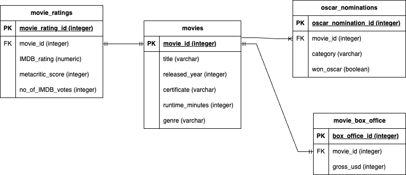

# data-modeling-etl
This is a simple repository that shows how to use Python and SQL to model data in PostGres and implement an ETL job to ingest data from a local file into PostGres.

## The Dataset
We will be using the following datasets:
- IMDB top 1000 movies dataset: https://www.kaggle.com/datasets/harshitshankhdhar/imdb-dataset-of-top-1000-movies-and-tv-shows
- Oscar Nominations dataset: https://www.kaggle.com/datasets/unanimad/the-oscar-award

## The Data Model
Although the datasets are relatively small, they come packed with data that we can use to answer several questions regarding movies.
In this project, we will generate a data model that can help us explore how a movie's ratings from IMDB and Metacritic relates to a movie's Oscar success and commercial success.

If we wish to gain insights into this, we first need to get the data into our RDMS (in this case PostGres) in relational form.

We can create the following tables:

- movies
- movie_ratings
- movie_box_office
- oscar_nominations

I've attached a draw.io entity-relationship diagram below that shows our physical data model:

## Cleaning the Data
Next, we use Python and Pandas in our jupyter notebook to read the data files and extract the columns we need from each into its own dataframe.
We perform the necessary data processing on the columns (e.g. convert the runtime from varchar - 123 min to an integer 123).
